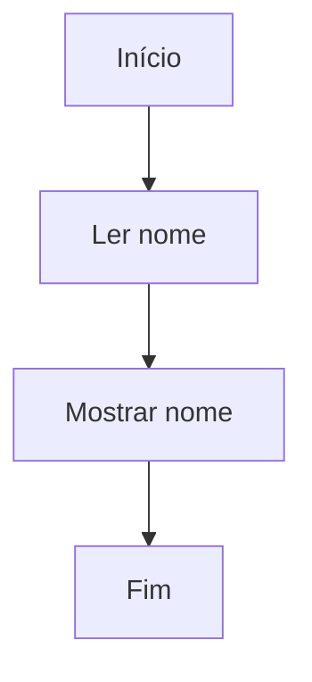
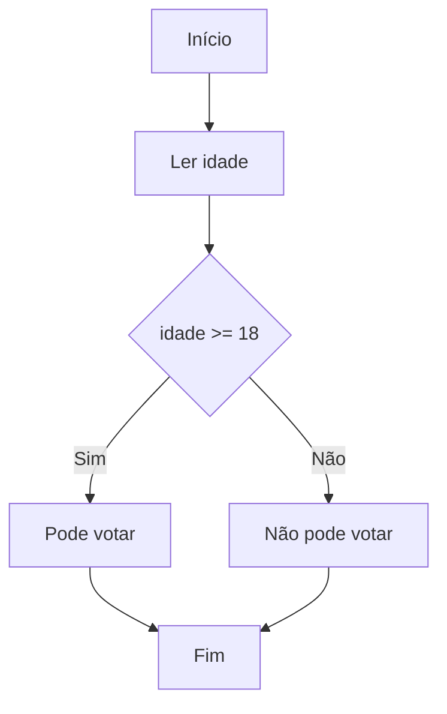
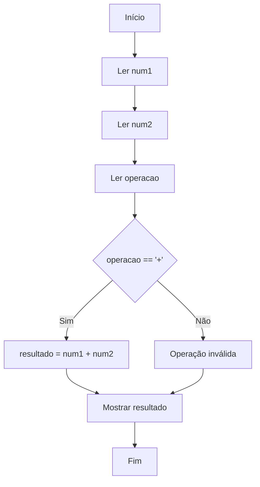

# 📄 Documentação do Sistema de Fluxogramas Interativos

Sistema de fluxogramas educacionais usando sintaxe Mermaid com execução passo-a-passo para ensino de algoritmos.

---

## 🎯 Status Atual: **FUNCIONAL E COMPLETO**

### ✅ Funcionalidades Principais
- **Parser Mermaid**: Converte fluxogramas em código JavaScript executável
- **Execução Passo-a-Passo**: Debugging educacional com destaque visual
- **Execução Automática**: Execução completa com pausas em entradas
- **Editor com Syntax Highlighting**: Cores para diferentes elementos Mermaid
- **Numeração de Linhas**: Sincronizada com scroll
- **Interface Responsiva**: Layout otimizado para desktop/tablet/mobile

### ✅ Componentes do Sistema

#### **`script.js`** - Controlador Principal
- Gerencia interface e eventos
- Coordena parser, executor e rendering
- Controla zoom, console e carregamento de exemplos

#### **`unified-parser.js`** - Parser Mermaid
- Converte sintaxe Mermaid em estruturas executáveis
- Suporta todos os formatos: `A[texto]`, `B{decisão}`, `A --> B`, `A -->|label| B`
- Detecta tipos de nós: início, entrada, processo, decisão, saída, fim

#### **`step-by-step-executor.js`** - Executor Educacional
- Execução controlada nó por nó
- Destaque visual do nó atual
- Preservação de estado entre passos

#### **`codemirror-config.js`** - Syntax Highlighting
- Sistema de overlay que adiciona cores ao código
- Compatível com textarea original
- Highlighting em tempo real

#### **`style.css`** - Interface Otimizada
- Layout responsivo com 98% aproveitamento da tela
- Cores do syntax highlighting
- Componentes visuais otimizados

---

## 🎨 Syntax Highlighting - **RECÉM IMPLEMENTADO**

### Cores Aplicadas
- **`graph TD`, `flowchart`** → **Vermelho** (#d73a49) e negrito
- **`A`, `B`, `C`** (IDs dos nós) → **Roxo** (#6f42c1) 
- **`[Início]`, `{decisão}`** (texto dos nós) → **Azul escuro** (#032f62)
- **`-->`, `==>`** (conectores) → **Laranja** (#e36209) e negrito
- **`|Sim|`, `|Não|`** (labels) → **Verde** (#22863a) e itálico
- **`%% comentário`** → **Cinza** (#6a737d) e itálico

### Como Funciona
1. Overlay transparente posicionado atrás do textarea
2. Textarea fica transparente, usuário vê as cores do overlay
3. Highlighting atualiza em tempo real conforme digita
4. Se falhar, textarea original continua funcionando

### Inicialização
- Automática após 500ms do carregamento da página
- Fallback seguro para textarea sem highlighting

---

## 🚀 Exemplos Suportados

### Básico


### Com Decisão


### Calculadora


---

## 🔧 Arquivos Principais

| Arquivo | Função | Status |
|---------|--------|--------|
| `index.html` | Interface principal | ✅ Funcional |
| `script.js` | Controlador | ✅ Funcional |
| `unified-parser.js` | Parser Mermaid | ✅ Funcional |
| `step-by-step-executor.js` | Executor | ✅ Funcional |
| `codemirror-config.js` | Syntax highlighting | ✅ **NOVO** |
| `style.css` | Estilos | ✅ Funcional |

---

## 🎮 Como Usar

1. **Carregar página**: `index.html` no navegador
2. **Selecionar exemplo**: Dropdown no editor
3. **Ou digitar código**: Syntax highlighting automático
4. **Executar**: 
   - "▶️ Executar Tudo" - execução automática
   - "👣 Passo a Passo" - execução controlada
5. **Preencher entradas**: Campos gerados automaticamente
6. **Acompanhar execução**: Console ou destaque visual

---

## 📊 Modificações Recentes

### Implementação do Syntax Highlighting (Julho 2025)
- **`codemirror-config.js`**: Sistema completo de highlighting criado
- **`style.css`**: Adicionadas classes CSS para cores
- **`script.js`**: Inicialização automática do highlighting
- **Teste**: `teste-highlighting.html` para verificação isolada

### Resultado
✅ Editor agora mostra código Mermaid com cores em tempo real  
✅ Zero impacto nas funcionalidades existentes  
✅ Fallback automático se highlighting falhar  

---

## 🔍 Debugging

### Console do Navegador
```javascript
// Verificar se highlighting está ativo
window.simpleHighlighter.isReady()

// Testar highlighting
testHighlighting()

// Verificar elementos
document.getElementById('mermaid-editor')
```

### Status dos Componentes
- **Parser**: Sempre funcional
- **Executor**: Sempre funcional  
- **Highlighting**: Ativa se `codemirror-config.js` carregou
- **Interface**: Sempre funcional

---

**Status Final**: **SISTEMA COMPLETO E FUNCIONAL**  
**Última atualização**: Julho 2025 - Syntax Highlighting implementado  
**Bugs conhecidos**: Nenhum  
**Performance**: Excelente