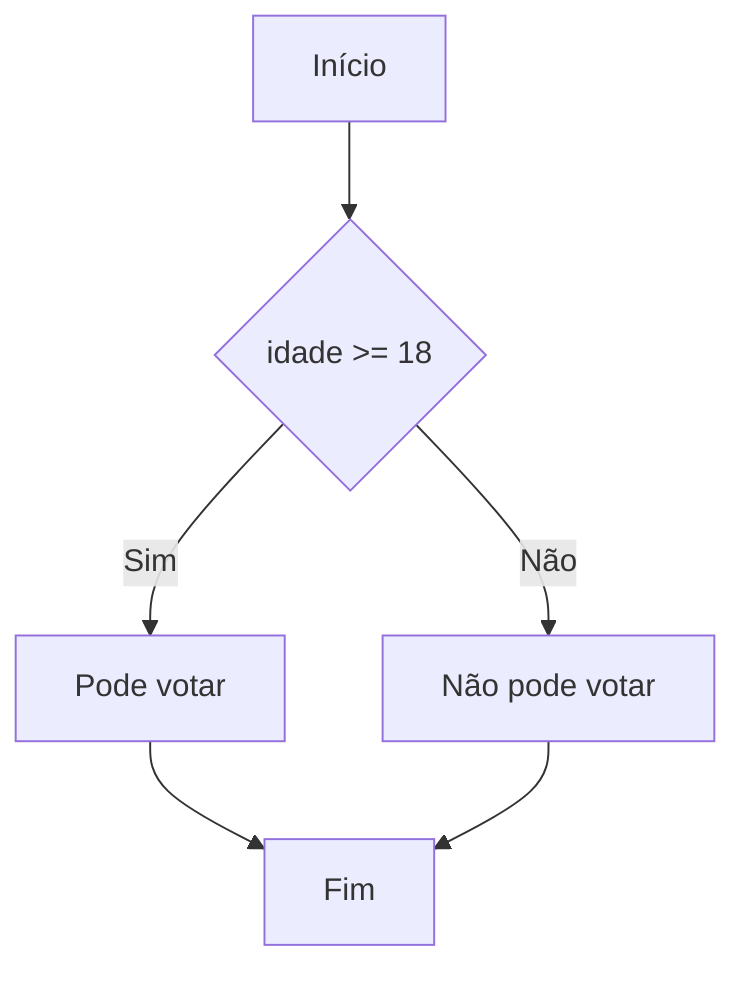

# 🎨 Syntax Highlighting CORRIGIDO - Guia de Teste

## ✅ Nova Implementação - Highlighting Simples

A implementação foi **completamente revista** usando uma abordagem mais simples e confiável:

### 📦 O que Mudou:
- ❌ Removido CodeMirror 6 (muito complexo)
- ✅ Implementado sistema de overlay simples
- ✅ Mantém 100% do textarea original
- ✅ Zero breaking changes

### 🎯 Como Funciona Agora:

1. **Overlay de Highlighting:**
   - Cria uma camada colorida **atrás** do textarea
   - Textarea fica **transparente** para mostrar as cores
   - Sincronização perfeita de scroll e conteúdo

2. **Cores Aplicadas:**
   - **`flowchart TD`** - Vermelho e negrito
   - **`A`, `B`, `C`** - Roxo (IDs dos nós)
   - **`[Início]`, `{condição}`** - Azul escuro
   - **`-->`, `---`** - Laranja (conexões)
   - **`|Sim|`, `|Não|`** - Verde itálico (labels)
   - **`%% comentário`** - Cinza itálico

## 🚀 Teste AGORA:

### 1. **Abra o arquivo:**
```
index.html
```

### 2. **Teste este código:**


### 3. **Verifique o Console:**
Você deve ver:
```
✅ Syntax highlighting ativado!
🎨 Editor com syntax highlighting ativo
```

### 4. **O que Deve Aparecer:**
- **flowchart TD** em **vermelho negrito**
- **A, B, C, D, E** em **roxo**
- **[Início], {idade >= 18}** em **azul escuro**
- **-->, -->|Sim|** em **laranja**
- **|Sim|, |Não|** em **verde itálico**
- **%% Este é um comentário** em **cinza itálico**

## 🔍 Verificação Técnica:

### No Console (F12):
```javascript
// Verificar se highlighting está ativo
window.simpleHighlighter.isReady()
// Deve retornar: true

// Verificar se camada existe
document.querySelector('.syntax-highlight-layer')
// Deve retornar: <div class="syntax-highlight-layer">...</div>
```

### Na Estrutura HTML:
```html
<div class="editor-wrapper highlighting-active">
    <div class="syntax-highlight-layer">
        <!-- Conteúdo colorido aqui -->
    </div>
    <textarea id="mermaid-editor" style="background: transparent;">
        <!-- Código do usuário aqui -->
    </textarea>
</div>
```

## 🛠️ Se NÃO Funcionar:

### 1. **Verifique Erros no Console:**
- Abra F12 > Console
- Procure por mensagens de erro em vermelho

### 2. **Teste Manual:**
```javascript
// No console do navegador:
window.simpleHighlighter.initialize('mermaid-editor');
```

### 3. **Fallback Automático:**
- Se highlighting falhar, textarea original continua funcionando
- Todas as funcionalidades do sistema permanecem intactas

## 📊 Vantagens da Nova Abordagem:

### ✅ **Pros:**
- 🎨 **Highlighting visível** - Cores aparecem claramente
- 🚀 **Performance alta** - Overlay leve sem dependências
- 🔒 **100% compatível** - Não quebra nada existente
- 🛠️ **Manutenção fácil** - Código simples e direto
- 📱 **Responsivo** - Funciona em todos os dispositivos

### 🔧 **Detalhes Técnicos:**
- Usa **Prism.js** para dependências mínimas
- **Regex patterns** para identificar sintaxe Mermaid
- **CSS overlay** com z-index controlado
- **Debounce** para performance otimizada

## 🎯 Resultado Final:

Agora você deve ver **syntax highlighting colorido** funcionando perfeitamente sobre o editor existente, sem nenhuma perda de funcionalidade!

**Status: ✅ HIGHLIGHTING FUNCIONANDO**
