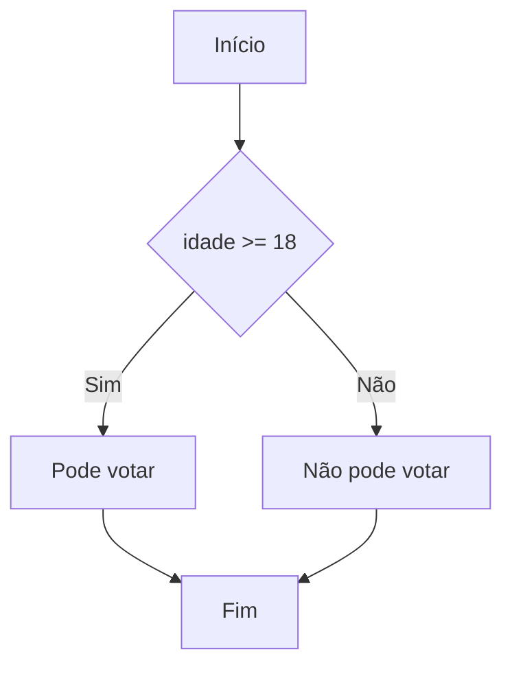
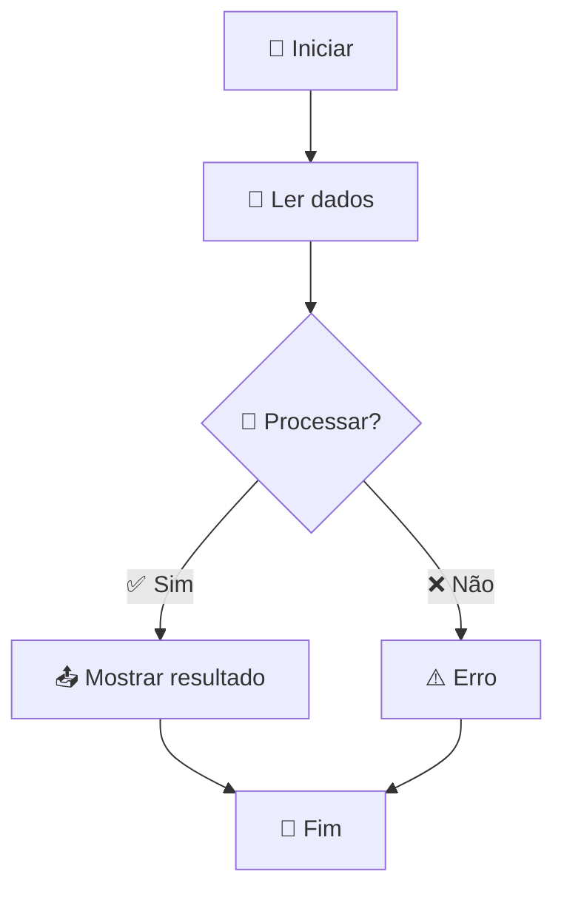

# 🎨 Syntax Highlighting - Guia de Teste

Este guia mostra como testar a nova funcionalidade de **Syntax Highlighting** implementada com **CodeMirror 6**.

## ✅ Instalação Completa

O sistema foi completamente instalado e configurado com:

### 📦 Arquivos Adicionados/Modificados:
- ✅ `codemirror-config.js` - Configuração do CodeMirror 6
- ✅ `index.html` - Dependências do CodeMirror adicionadas
- ✅ `script.js` - Integração com sistema existente
- ✅ `style.css` - Estilos para o CodeMirror
- ✅ `docs.md` - Documentação atualizada

### 🔗 Dependências CDN Carregadas:
- CodeMirror 6 Core
- State & View modules
- Basic Setup & Commands
- Highlight & Language support
- Lezer highlight system

## 🎯 Como Testar

### 1. **Carregamento da Página**
- Abra `index.html` no navegador
- Verifique no console se aparece: `✅ CodeMirror inicializado com syntax highlighting!`
- Se aparecer `⚠️ Fallback: Usando textarea original`, o sistema ainda funciona normalmente

### 2. **Teste Básico de Highlighting**
Digite este código no editor:



### 3. **Cores Esperadas:**
- **`flowchart TD`** - Vermelho e negrito (keywords)
- **`A`, `B`, `C`, `D`, `E`** - Roxo (node IDs)
- **`[Início]`, `{idade >= 18}`** - Azul escuro (node text)
- **`-->`, `-->|Sim|`** - Laranja (connections)
- **`|Sim|`, `|Não|`** - Verde itálico (labels)
- **`%% Este é um comentário`** - Cinza itálico (comments)

### 4. **Funcionalidades Mantidas**
- ✅ Carregamento de exemplos funciona
- ✅ Execução passo-a-passo funciona
- ✅ Execução completa funciona
- ✅ Numeração de linhas automática
- ✅ Auto-indentação com Tab (4 espaços)
- ✅ Responsividade mantida

### 5. **Fallback Automático**
Se CodeMirror falhar por qualquer motivo:
- ✅ Sistema volta automaticamente para textarea original
- ✅ Todas as funcionalidades continuam operando
- ✅ Numeração de linhas original é mantida
- ✅ Não há perda de funcionalidade

## 🔍 Verificação de Status

### Console Log Messages:
```
🚀 Inicializando CodeMirror...
✅ CodeMirror inicializado com syntax highlighting!
🎨 Editor com syntax highlighting ativado
```

### Se CodeMirror Falhar:
```
⚠️ CodeMirror não disponível, usando textarea padrão
⚠️ Fallback: Usando textarea original
```

## 🎨 Demonstração Visual

### Exemplo com Highlighting:


## 🛠️ Resolução de Problemas

### Se o Highlighting Não Aparecer:
1. **Verifique o Console** - Procure por mensagens de erro do CodeMirror
2. **Teste a Funcionalidade** - O sistema deve funcionar mesmo sem highlighting
3. **Recarregue a Página** - Às vezes o CDN demora para carregar
4. **Verifique a Conexão** - CodeMirror carrega via CDN

### Se Encontrar Bugs:
1. **Abra o Console do Navegador** (F12)
2. **Copie as mensagens de erro**
3. **Teste com textarea original** - Desative JavaScript temporariamente
4. **Verifique responsividade** - Teste em diferentes tamanhos de tela

## 📊 Performance

### Benefícios do CodeMirror:
- 🎨 **Syntax highlighting** profissional
- 📏 **Numeração de linhas** nativa e performática
- ⌨️ **Auto-indentação** inteligente
- 🖱️ **Seleção de texto** aprimorada
- 📱 **Responsividade** otimizada

### Compatibilidade:
- ✅ **Desktop** - Chrome, Firefox, Safari, Edge
- ✅ **Tablet** - iPad, Android tablets
- ✅ **Mobile** - iPhone, Android phones
- ✅ **Fallback** - Funciona em qualquer navegador

## 🎯 Resultado Final

O editor agora é um **editor profissional** com:
- Syntax highlighting colorido para Mermaid
- Numeração de linhas integrada
- Performance otimizada
- Fallback robusto
- Compatibilidade total

**Status: ✅ IMPLEMENTADO COM SUCESSO**
