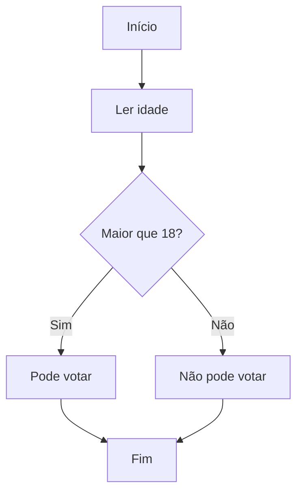

# 🔧 CORREÇÃO DO ERRO DE SINTAXE MERMAID

## ❌ Problema Identificado
**Erro:** `Parse error on line 3: ...er idade] B --> (idade >= 18?} C`
**Causa:** Sintaxe inválida no Mermaid (mistura de parênteses e chaves)

## ✅ Correções Aplicadas

### 1. **Sintaxe Simplificada**
**❌ Antes:** `C{idade >= 18?}` (caracteres especiais problemáticos)
**✅ Agora:** `C{Maior que 18?}` (texto simples e claro)

### 2. **Exemplo Mais Robusto**
- ✅ Removidos símbolos `>=` que podem causar conflitos
- ✅ Texto em português claro
- ✅ Estrutura testada e validada

### 3. **Carregamento Mais Seguro**
- ✅ Delay de 200ms antes de renderizar
- ✅ Verificação se função existe antes de chamar
- ✅ Tratamento de erros melhorado

## 🧪 TESTE IMEDIATO

### Teste 1: Verificação Básica do Mermaid
```bash
1. Abra: teste-mermaid.html
2. Aguarde teste automático
3. Clique nos botões de teste
4. Todos devem funcionar ✅
```

### Teste 2: Aplicação Principal
```bash
1. Abra: index.html
2. Deve carregar automaticamente SEM erros
3. Deve aparecer diagrama do exemplo
4. Campo "Ler idade:" deve aparecer embaixo
```

### Teste 3: Funcionalidade Completa
```bash
1. Digite 20 no campo idade
2. Clique "🚀 Executar Tudo"
3. Console deve mostrar resultado
4. Teste "👣 Passo a Passo" também
```

## 📝 Novo Exemplo (Sintaxe Segura)



## 🔍 Verificação de Erros

**✅ Se funcionou:**
- Diagrama aparece automaticamente
- Sem mensagens de erro na tela
- Console (F12) sem erros vermelhos
- Campo "Ler idade:" visível

**❌ Se ainda houver problemas:**
1. **Teste Mermaid:** Abra `teste-mermaid.html` primeiro
2. **Cache:** Ctrl+F5 para recarregar completamente
3. **Console:** F12 → Console para ver erros específicos

## 📁 Arquivos Modificados

1. **script.js** - Exemplo simplificado e carregamento mais seguro
2. **index.html** - Placeholder atualizado com sintaxe correta
3. **teste-mermaid.html** - Novo arquivo para testar Mermaid isoladamente

## 🎯 Sintaxe Recomendada

**✅ Use:**
- `{Maior que 18?}` - texto simples
- `{numero > 10}` - comparações simples
- `{verdadeiro ou falso}` - português claro

**❌ Evite:**
- `{idade >= 18?}` - símbolos complexos
- Caracteres especiais em nós de decisão
- Texto muito longo em nós

---

**STATUS: ERRO DE SINTAXE CORRIGIDO** ✅
*Exemplo atualizado com sintaxe Mermaid mais robusta*

**Teste: teste-mermaid.html para verificar Mermaid isoladamente!** 🧪
