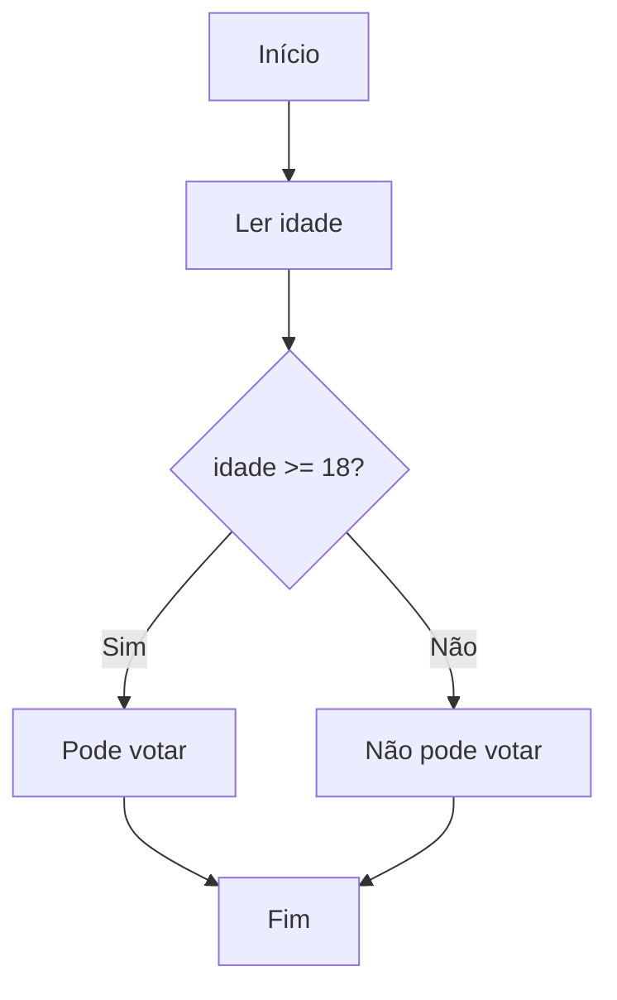

# Fluxograma Interativo - Versão Consolidada

Uma ferramenta web interativa refinada para ensino de raciocínio algorítmico que permite criar fluxogramas usando Mermaid.js, convertê-los em JavaScript e executá-los passo a passo ou completamente.

## 🚀 Principais Melhorias

### ✅ Correções Implementadas
- **Parser Unificado**: Consolidação de múltiplos parsers em uma única implementação robusta
- **Execução Passo-a-Passo Funcional**: Implementação completa com destaque visual e controle de estado
- **Tratamento de Erros Aprimorado**: Mensagens claras e recovery gracioso
- **Interface Modernizada**: Melhor feedback visual e responsividade
- **Código Limpo**: Remoção de redundâncias e consolidação da arquitetura

### 🔧 Arquitetura Simplificada
```
├── index.html                    # Interface principal
├── style.css                     # Estilos modernos e responsivos
├── script.js                     # Controlador principal
├── unified-parser.js             # Parser consolidado
├── step-by-step-executor.js      # Executor passo-a-passo
└── README.md                     # Esta documentação
```

## 📋 Funcionalidades

### ✅ Completamente Funcionais
- **Editor Visual**: Interface intuitiva com renderização em tempo real
- **Execução Completa**: Conversão automática para JavaScript e execução
- **Execução Passo-a-Passo**: Controle detalhado com destaque visual do nó atual
- **Variáveis de Entrada**: Sistema automático de campos de entrada
- **Console Interativo**: Saída formatada com timestamps e scrolling
- **Tratamento de Erros**: Mensagens claras para problemas de sintaxe
- **Zoom e Navegação**: Controles para visualização do diagrama
- **Design Responsivo**: Funciona em desktop e dispositivos móveis

### 🎯 Tipos de Nós Suportados
- **Início/Fim**: `A[Início]`, `F[Fim]`
- **Entrada**: `B[Ler idade]`, `C[Digite nome]`
- **Processo**: `D[Calcular resultado]`
- **Decisão**: `C{idade >= 18?}`, `D{x > 0?}`
- **Saída**: `E[Mostrar resultado]`, `F[Pode votar]`

## 🎮 Como Usar

### 1. Criando um Fluxograma
Digite no editor usando sintaxe Mermaid:


### 2. Execução Completa
1. Clique em **"🚀 Executar Tudo"**
2. Preencha os campos de entrada se necessário
3. Veja o resultado no console

### 3. Execução Passo-a-Passo
1. Clique em **"👣 Executar Passo a Passo"**
2. Preencha as variáveis de entrada
3. Use **"➡️ Próximo Passo"** para avançar
4. Use **"⬅️ Passo Anterior"** para voltar
5. Observe o destaque visual no nó atual

### 4. Controles Disponíveis
- **🔄 Reiniciar**: Reseta a execução
- **🔍+ / 🔍-**: Zoom in/out no diagrama
- **📐**: Ajustar diagrama à tela

## 💻 Tecnologias

- **Frontend**: HTML5, CSS3, JavaScript ES6+
- **Renderização**: Mermaid.js v10.6.1
- **Parsing**: Parser customizado com regex
- **Execução**: Geração dinâmica de JavaScript
- **Styling**: CSS Grid/Flexbox com gradientes modernos

## 🎨 Recursos Visuais

### Interface Moderna
- Gradientes visuais atraentes
- Animações suaves nos botões
- Destaque pulsante no nó atual durante execução passo-a-passo
- Console estilo terminal com syntax highlighting
- Feedback visual claro para estados (normal, executando, passo-a-passo)

### Responsividade
- Layout adaptativo para mobile e desktop
- Controles otimizados para touch
- Texto legível em qualquer tamanho de tela

## 📝 Exemplos Práticos

### Verificação de Maioridade


### Calculadora Simples
```mermaid
flowchart TD
    A[Início] --> B[Ler primeiro número]
    B --> C[Ler segundo número]
    C --> D[Ler operação]
    D --> E{operação == "+"}
    E -->|Sim| F[resultado = num1 + num2]
    E -->|Não| G{operação == "-"}
    G -->|Sim| H[resultado = num1 - num2]
    G -->|Não| I[Operação inválida]
    F --> J[Mostrar resultado]
    H --> J
    I --> J
    J --> K[Fim]
```

### Classificação de Números
```mermaid
flowchart TD
    A[Início] --> B[Ler número]
    B --> C{número > 0?}
    C -->|Sim| D[Mostrar "Positivo"]
    C -->|Não| E{número < 0?}
    E -->|Sim| F[Mostrar "Negativo"]
    E -->|Não| G[Mostrar "Zero"]
    D --> H[Fim]
    F --> H
    G --> H
```

## 🛠️ Instalação

1. Baixe todos os arquivos do projeto
2. Abra `index.html` em um navegador moderno
3. Não requer servidor web - funciona localmente

## 🌐 Compatibilidade

- **Chrome**: 80+
- **Firefox**: 75+
- **Safari**: 13+
- **Edge**: 80+

## 🎯 Objetivos Educacionais

Esta ferramenta foi desenvolvida especificamente para:

1. **Ensinar Lógica de Programação**: Visualização clara do fluxo algorítmico
2. **Debugging Mental**: Execução passo-a-passo para entender cada etapa
3. **Sintaxe Amigável**: Uso de português nas descrições dos nós
4. **Feedback Imediato**: Resultado visual e textual instantâneo
5. **Experimentação Segura**: Ambiente controlado para testar algoritmos

## 🔧 Estrutura Técnica

### Parser Unificado (`unified-parser.js`)
- Análise robusta de sintaxe Mermaid
- Detecção automática de tipos de nós
- Extração de variáveis de entrada
- Geração de código JavaScript otimizado

### Executor Passo-a-Passo (`step-by-step-executor.js`)
- Controle granular da execução
- Destaque visual do nó atual
- Gerenciamento de estado das variáveis
- Navegação bidirecional (próximo/anterior)

### Script Principal (`script.js`)
- Orquestração de todos os componentes
- Interface reativa com feedback visual
- Gerenciamento de eventos e estados
- Console integrado com logging

## 🚨 Solução de Problemas

### Fluxograma não aparece
- Verifique a sintaxe Mermaid
- Certifique-se de começar com `flowchart TD`
- Verifique se todos os colchetes/chaves estão fechados

### Execução não funciona
- Verifique se há um nó de início: `A[Início]`
- Preencha todos os campos de entrada obrigatórios
- Verifique se as condições usam operadores válidos (`>=`, `<=`, `>`, `<`)

### Passo-a-passo não avança
- Certifique-se de que preencheu todas as variáveis
- Verifique se existe caminho válido entre os nós
- Use "Reiniciar" se necessário

## 🏆 Características Avançadas

### Detecção Inteligente de Variáveis
O sistema detecta automaticamente variáveis em textos como:
- "Ler idade" → variável `idade`
- "Digite nome" → variável `nome`
- "Entrada valor" → variável `valor`

### Conversão de Condições
Converte automaticamente expressões em português:
- `idade >= 18` → JavaScript válido
- `número > 0` → Avaliação booleana
- `operação == "+"` → Comparação de strings

### Geração de Código
Produz JavaScript limpo e comentado:
- Declaração automática de variáveis
- Tratamento de entrada do usuário
- Estruturas condicionais apropriadas
- Logging detalhado para debugging

---

**Desenvolvido para auxiliar no ensino de raciocínio algorítmico e programação** 🎓

*Versão consolidada com arquitetura simplificada e funcionalidades completas*
